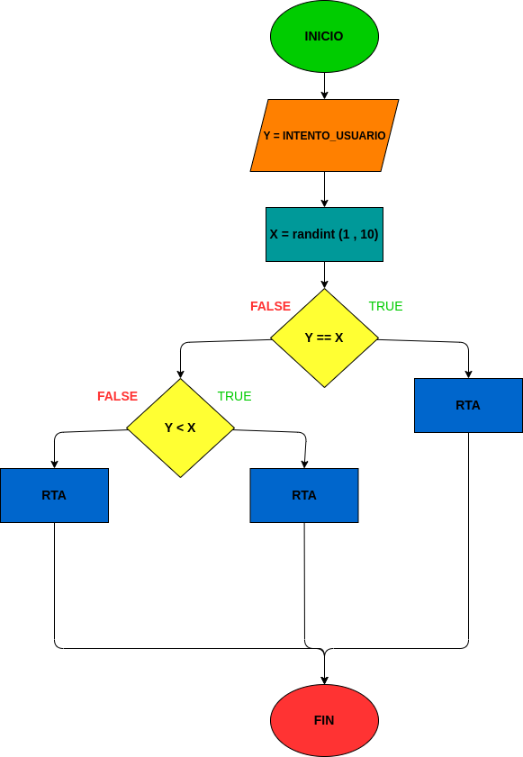

# Adivina_el_numero
Numeros aleatorios en python

# INPUT
Variables de entrada (input)

Y = El numero que el usuario piensa que es

Variables de proceso (processing)

X = randint(1 , 10)

if: Y == X

elif: Y < X

else: Y < X>

Variables de Salida (oput)

RTA: ¡Correcto! ¡Has adivinado el número

RTA: El número que estas pensando es mas bajo. El numero era " + str(X)

RTA: El número que estas pensando es más alto. El numero era " + str(X)

# DISEÑO

# CONSTUCCION